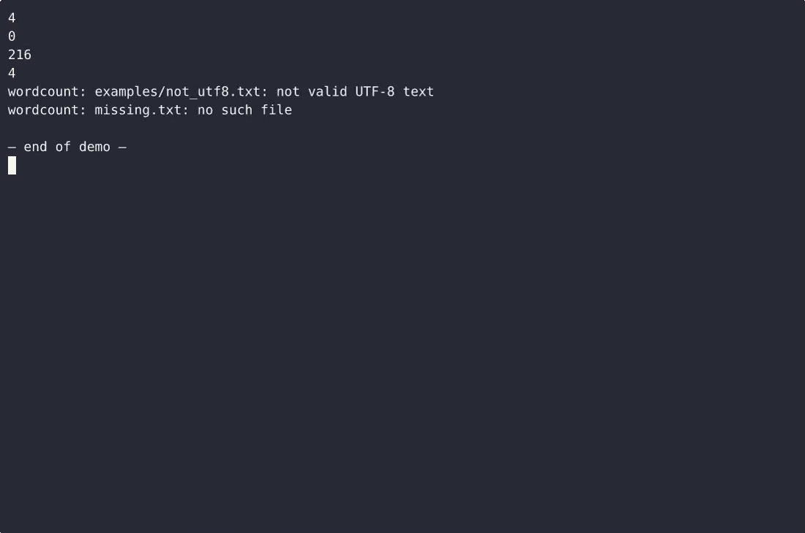

# wordcount CLI — complete Full-stack app command-line tool example app

**wordcount CLI** gives you two paths: self-host the Apache-2.0-licensed Full-stack app source as your own command-line tool, or [open it on cenius.ai](https://cenius.ai/marketplace/p/wordcount-cli-7?ref=gh&utm_campaign=wordcount-cli-webapp-7), describe the changes you want, and receive a new wordcount CLI build with full rebrand rights. Build wordcount.py, a single dependency-free Python 3 file: run `python wordcount.py <file>` and it prints the number of whitespace-separated words in that file, with clear stderr messages and non-zero exit codes when…. Everything ships in this repo — no paywall, no hidden features, no separate wordcount CLI download.


[](LICENSE)  [](https://cenius.ai)

[](https://cenius.ai/marketplace/p/wordcount-cli-7?ref=gh&utm_campaign=wordcount-cli-webapp-7)

> **▶ [Open & edit in cenius.ai](https://cenius.ai/marketplace/p/wordcount-cli-7?ref=gh&utm_campaign=wordcount-cli-webapp-7)** — one click to an editable workspace: describe changes in plain English, get an instant preview, one-click deploy and host. Modifications made on the platform come with full rebrand & relicense rights.

_Local clone? See [Quick start](#quick-start) below. cenius.ai is the zero-setup path._

## Demo


▶ **[See it in action](https://cenius.ai/marketplace/p/wordcount-cli-7?ref=gh&utm_campaign=wordcount-cli-webapp-7)** — full demo on the project page · [MP4](.github/media/demo.mp4)

## Screenshots

 

## Quick start

```bash
./install.sh   # installs dependencies + seeds demo data
```

See [`INSTALL.md`](INSTALL.md) for full setup and usage instructions.

## Architecture

A self-contained Full-stack app project (29 files): top-level directories include `examples/`, `tests/`. Run `./install.sh` once to install packages and populate demo data — the app is ready to use immediately after. Installation walkthrough: [`INSTALL.md`](INSTALL.md).

## Features

- Count words in a file
- CLI entry point and output
- Input validation and error reporting

## Usage guide

Every walkthrough below was run against the code in this checkout. There is
exactly one invocation form, so this is a short document.

### 1. Count the words in a file

```console
$ python3 wordcount.py examples/sample.txt
4
$ echo $?
0
```

The file is read as UTF-8 and counted; the number is the only thing on stdout.

### 2. Files that legitimately count as zero

A zero-byte file and a file holding nothing but whitespace both print `0` — a
whitespace run is never a word, and empty text split on whitespace yields
nothing.

```console
$ python3 wordcount.py examples/empty.txt
0
$ python3 wordcount.py examples/whitespace.txt
0
```

### 3. Runs of separators never inflate the count

Tabs, newlines and repeated spaces all separate words, and leading or trailing
whitespace is ignored, so the same sentence split across lines still counts the
same:

```console
$ printf 'one  two\tthree\n four ' > /tmp/odd.txt
$ python3 wordcount.py /tmp/odd.txt
4
```

### 4. Use it in a script or a pipeline

stdout carries the integer plus one newline and nothing else, so capture and
pipes behave without trimming:

```console
$ words=$(python3 wordcount.py examples/release_notes.md)
$ echo "counted $words words"
counted 216 words
$ python3 wordcount.py examples/release_notes.md | wc -c
4
```

Branch on the exit status:

```bash
if python3 wordcount.py "$1" > /tmp/count.txt; then
    echo "the file has $(cat /tmp/count.txt) words"
else
    echo "could not count $1" >&2   # the reason is already on stderr
fi
```

_Full guide: [`USAGE.md`](USAGE.md)_

## FAQ

### Can I deploy wordcount CLI on my own infrastructure?

It runs entirely on your own machine. Clone, run `./install.sh`, and follow [`INSTALL.md`](INSTALL.md) — the whole stack is in this repo, no external dependencies required.

### What if I want to add features to wordcount CLI without coding?

Describe what you want changed on [cenius.ai](https://cenius.ai/marketplace/p/wordcount-cli-7?ref=gh&utm_campaign=wordcount-cli-webapp-7) — no code editing needed; the platform produces a fresh build you can download and deploy.

### What is wordcount CLI built with?

wordcount CLI runs on Full-stack app. This repo holds the full production source: you can inspect every part of it before deploying. Highlights include input validation and error reporting.

### Can I use wordcount CLI in a commercial project?

The code is under the Apache-2.0 license, which allows commercial use without restriction. You can build, sell, and deploy it freely. Full text: [LICENSE](LICENSE).

### How do I make wordcount CLI my own brand?

Yes — and the easiest way is [remixing it on cenius.ai](https://cenius.ai/marketplace/p/wordcount-cli-7?ref=gh&utm_campaign=wordcount-cli-webapp-7): modifications made on the platform come with full rebrand and relicense rights over your derivative.

## License & rebranding

Released under the [Apache License 2.0](LICENSE) (© 2026 Cenius AI) — free for personal and commercial use. The Cenius name/logo are trademarks (see NOTICE).

**Need a customized version?** [Remix this app on cenius.ai](https://cenius.ai/marketplace/p/wordcount-cli-7?ref=gh&utm_campaign=wordcount-cli-webapp-7) — modifications made on the platform come with **full rebrand & relicense rights** over your derivative.

## Built with cenius.ai

This entire application — code, design, seeded demo data — was generated on **[cenius.ai](https://cenius.ai)** from a plain-English description.

- 🚀 [Build your own app on cenius.ai](https://cenius.ai)
- 🎛️ [Remix wordcount CLI on the marketplace](https://cenius.ai/marketplace/p/wordcount-cli-7?ref=gh&utm_campaign=wordcount-cli-webapp-7) — open it in a workspace, prompt for changes, and ship your own version.

More open-source apps: [the Cenius-ai catalog](https://github.com/Cenius-ai) · [showcase index](https://github.com/Cenius-ai/showcase)
